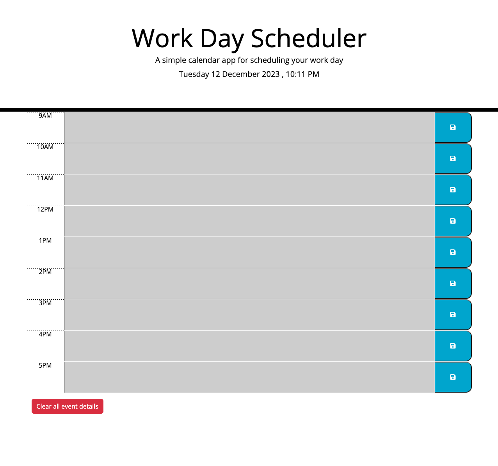

# planner-app
A simple calendar application that allows a user to save events for each hour of the day.

## Table of Contents

- [Full Description](#full-description)
- [Features](#features)
- [How to Use](#how-to-use)
- [Screenshot](#screenshot)

## Full Description

A simple calendar application that allows a user to save events for each hour of the day.  This app runs in the browser and features dynamically updated HTML and CSS powered by jQuery.
URL of deployed app:  https://feliperyder.github.io/planner-app/

## Features

* Displays the current day at the top of the calender when a user opens the planner.
 
* Presents timeblocks for standard business hours when the user scrolls down.
 
* Color-code timeblocks based on past, present, and future when the timeblock is viewed.
 
* Allows a user to enter an event when they click a timeblock

* Saves the event in local storage when the save button is clicked in that timeblock.

* Events persist between refreshes of a page.

## How to Use

1. Open URL of deployed app:  https://feliperyder.github.io/planner-app/
2. Click timeblock to add an event to planner
3. Click to save
4. View full schedule.

## Screenshot

